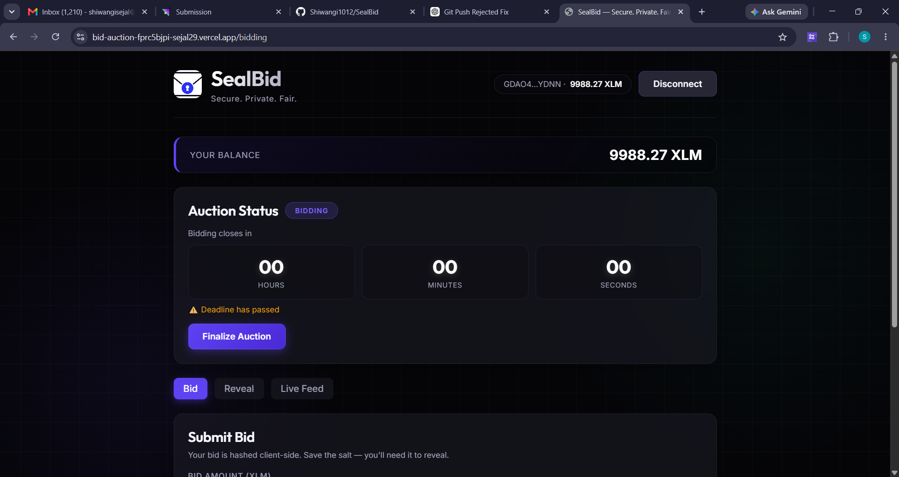
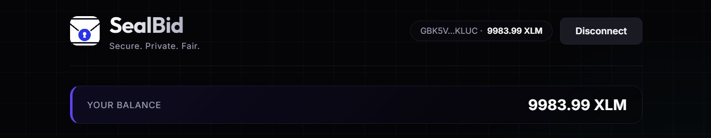
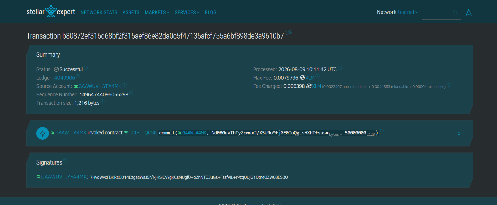
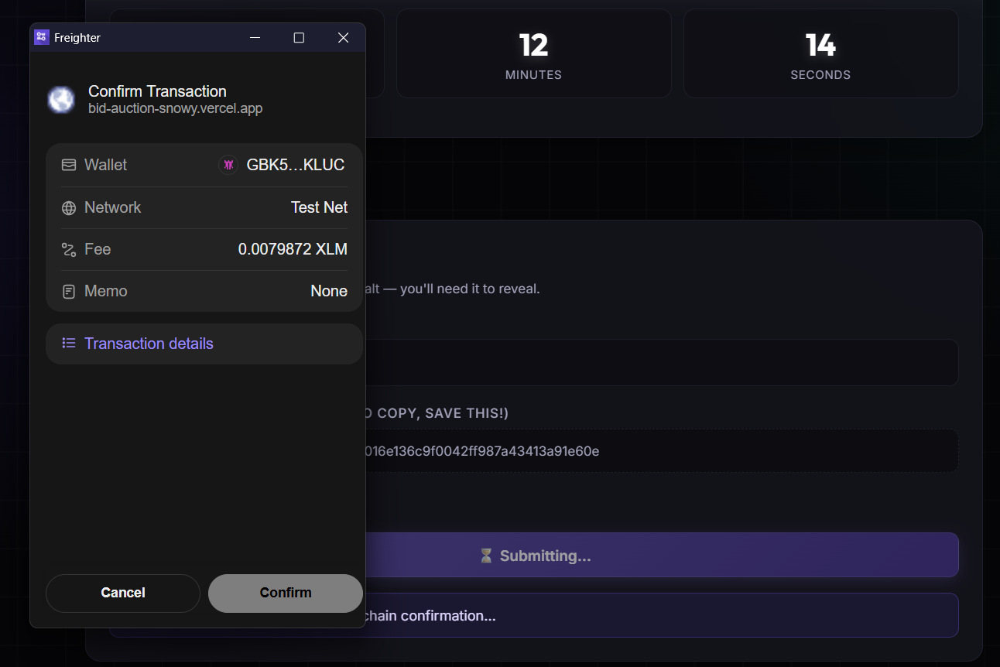
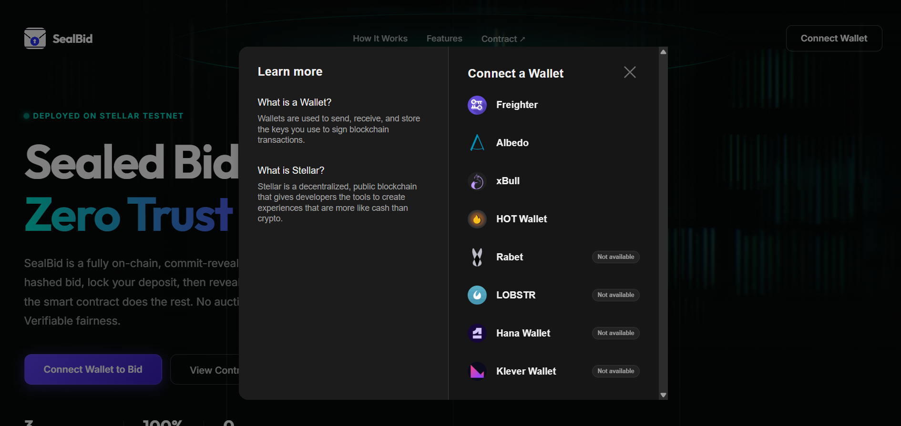
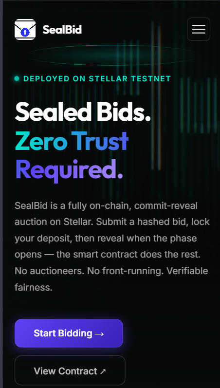

# SealBid — On-chain Sealed-Bid Auction with Time-Lock Vault

> Commit your bid as a hash. Lock your XLM in a vault. Reveal after the deadline.
> Winner takes it — losers are auto-refunded. No auctioneer, no trust, no front-running.

| Item | Value |
|---|---|
| Live demo | [https://bid-auction-snowy.vercel.app/](https://bid-auction-snowy.vercel.app/) |
| Demo video | [YouTube demo](https://youtu.be/YOUR_VIDEO_ID) |
| Network | Stellar Testnet (Test SDF Network ; September 2015) |
| AuctionContract | [`CCDTXP7TMGEEMGUQT3FCWYW4YOTENQVCIMAI3Z4QAPM4BGUGDGMRWDCB`](https://stellar.expert/explorer/testnet/contract/CCDTXP7TMGEEMGUQT3FCWYW4YOTENQVCIMAI3Z4QAPM4BGUGDGMRWDCB) |
| TimeLockVaultContract | [`CDZOINVUO7QY4V2VUA755Y4WFRLAAVJBNJH7XZIKF3DKOHIXHYEN5KAK`](https://stellar.expert/explorer/testnet/contract/CDZOINVUO7QY4V2VUA755Y4WFRLAAVJBNJH7XZIKF3DKOHIXHYEN5KAK) |
| RefundDistributorContract | [`CCRZYYLKJZFZLNZAETCLD6G2TJDBUWVNZC6DH4VJ2HYTFYUOOIUYRAVI`](https://stellar.expert/explorer/testnet/contract/CCRZYYLKJZFZLNZAETCLD6G2TJDBUWVNZC6DH4VJ2HYTFYUOOIUYRAVI) |

---

## Submission Checklist

### Level 1

- [x] Public GitHub repository
- [x] README with complete documentation — this file
- [x] Project description — see [What is this?](#what-is-this)
- [x] Setup instructions — see [Quick start](#quick-start)
- [x] Wallet connected state — 
- [x] Balance displayed — 
- [x] Successful testnet transaction — 
- [x] Transaction result shown to user — 

### Level 2

- [x] 3 error types handled — late reveal, hash mismatch, insufficient deposit (see [Error taxonomy](#error-taxonomy))
- [x] Contract deployed on testnet — see [Deployed contracts](#deployed-contracts)
- [x] Contract called from the frontend — `commit`, `reveal`, `finalize`, `claim_refund`, `get_state` in `src/utils/contractCall.ts`
- [x] Transaction status visible — pending spinner → confirmed hash → Stellar Expert link
- [x] Minimum 2+ meaningful commits
- [x] Multi-wallet app — Freighter, xBull, Albedo, Ledger, WalletConnect via `StellarWalletsKit` — 
- [x] Deployed contract address — `CCDTXP7TMGEEMGUQT3FCWYW4YOTENQVCIMAI3Z4QAPM4BGUGDGMRWDCB`
- [x] Transaction hash of a contract call — verifiable on [Stellar Expert](https://stellar.expert/explorer/testnet)
- [x] Live demo link — [https://bid-auction-snowy.vercel.app/](https://bid-auction-snowy.vercel.app/)

### Level 3

- [x] Advanced smart contract development — three-contract design: `AuctionContract` + `TimeLockVaultContract` + `RefundDistributorContract`; full phase state machine (Bidding → Reveal → Finalized)
- [x] Inter-contract communication — `AuctionContract` calls `TimeLockVaultContract.release` and `RefundDistributorContract.batch_refund` post-finalize
- [x] Event streaming and real-time updates — `useAuctionEvents` hook polls Soroban RPC for `reveal` events every 8 seconds; live feed component
- [x] Mobile-responsive frontend — mobile-first CSS, responsive countdown timer, scrollable reveal feed — 
- [x] Error handling and loading states — `ContractError` class with typed error map; pending/success/error states on all forms
- [x] Production-ready architecture — re-entrancy guard on `claim_refund`; commitment scheme matches contract exactly; salt stored in localStorage for reveal
- [x] Live demo link — [https://bid-auction-snowy.vercel.app/](https://bid-auction-snowy.vercel.app/)
- [x] Demo video (1–2 minutes) — [YouTube demo](https://youtu.be/YOUR_VIDEO_ID)

---

## What is this?

A sealed-bid auction is a bidding format where no bidder can see the other bids before the deadline. This protocol implements it trustlessly on Stellar / Soroban:

1. **Commit phase** — Bidders hash their bid amount + a secret salt client-side and submit the hash along with an XLM deposit. Nobody knows anyone else's bid.
2. **Reveal phase** — Each bidder submits their actual amount and salt. The contract verifies the hash matches. Bids that don't reveal are forfeit.
3. **Finalize** — The contract picks the highest valid reveal as the winner. All losing deposits are automatically refunded.

The auctioneer never touches the funds. The ledger timestamp enforces the deadlines without any centralized timer.

## Why Stellar?

Stellar's 5-second finality means the reveal phase resolves fast enough to be interactive. Soroban's ledger timestamp enables trustless deadline enforcement. The native token contract makes XLM deposits and refunds a single contract call.

## Architecture

```
AuctionContract
  ├── initialize(admin, native_token, bidding_deadline, reveal_deadline)
  ├── commit(bidder, commitment, deposit)   → sha256(amount_le ++ salt), locks XLM
  ├── reveal(bidder, amount, salt)          → verifies hash, emits reveal event
  ├── finalize()                            → picks winner after reveal deadline
  ├── claim_refund(bidder)                  → losers retrieve deposit
  ├── get_state()                           → Bidding | Reveal | Finalized
  └── get_winner()                          → Option<Address>

TimeLockVaultContract
  ├── initialize(auction_contract)
  └── release(to, amount)                   → only callable by AuctionContract

RefundDistributorContract
  ├── initialize(auction_contract)
  └── batch_refund(losers[])                → bulk XLM refunds
```

### Commitment scheme

```
Client-side:  commitment = sha256( amount_u64_le_bytes ++ salt_bytes_32 )
On submit:    AuctionContract.commit(commitment, xlm_deposit)
On reveal:    AuctionContract.reveal(amount, salt)
              contract re-computes and checks: sha256(amount_le ++ salt) == stored_commitment
```

### Auction phases

```
BIDDING  →  REVEAL  →  FINALIZED
  ↑ deadline enforced by ledger timestamp (env.ledger().timestamp())
```

## Error taxonomy

The frontend wraps all contract and RPC errors in a `ContractError` class and maps known Rust `panic!()` strings to user-friendly messages:

| Error | Contract panic | UI message |
|---|---|---|
| Late reveal | `not in reveal phase` | "Reveal phase has not started or has ended" |
| Hash mismatch | `hash mismatch` | "Hash mismatch — your amount or salt does not match the commitment" |
| Insufficient deposit | `deposit must be positive` | "Deposit must be greater than zero" |
| Already committed | `already committed` | "You have already submitted a bid for this auction" |
| Not finalized | `not finalized yet` | "The auction has not been finalized yet" |
| Winner refund | `winner cannot claim refund` | "You are the winner — you cannot claim a refund" |
| No deposit | `no deposit found` | "No deposit found for this address" |
| Already refunded | `already refunded` | "Your deposit has already been refunded" |

## Wallet support

The Connect button uses `StellarWalletsKit` with `allowAllModules()` to support all available Stellar wallets:

| Wallet | Kind |
|---|---|
| Freighter | Browser extension |
| xBull | Browser extension |
| Albedo | Web / extension |
| Ledger | Hardware wallet |
| WalletConnect | Mobile |

## Tech stack

| Layer | Technology |
|---|---|
| Contracts | Rust + Soroban SDK 22.0.0 |
| Blockchain | Stellar Testnet |
| Frontend | React 18 + Vite 6 + TypeScript 5 |
| Wallets | StellarWalletsKit (multi-wallet) |
| Real-time | Soroban RPC event polling |
| Styling | CSS custom properties, mobile-first |

## Quick start

### Prerequisites

- Rust with `wasm32-unknown-unknown` target (`rustup target add wasm32-unknown-unknown`)
- Stellar CLI 27+ (`stellar --version`)
- Node.js 20+ and npm 10+

### Build contracts

```bash
cd contracts
cargo build --target wasm32-unknown-unknown --release
```

Wasm artifacts land in `contracts/target/wasm32-unknown-unknown/release/`.

### Deploy contracts (optional — already deployed on testnet)

```bash
# Fund your deployer identity
stellar keys fund deployer --network testnet

# Deploy
stellar contract deploy --wasm contracts/target/wasm32-unknown-unknown/release/auction.wasm --source deployer --network testnet
stellar contract deploy --wasm contracts/target/wasm32-unknown-unknown/release/vault.wasm   --source deployer --network testnet
stellar contract deploy --wasm contracts/target/wasm32-unknown-unknown/release/refund.wasm  --source deployer --network testnet
```

### Run the frontend locally

```bash
npm install
cp .env.example .env   # or edit .env directly with your contract IDs
npm run dev
```

### Build for production

```bash
npm run build
```

## Environment variables

```env
VITE_AUCTION_CONTRACT_ID=CCDTXP7TMGEEMGUQT3FCWYW4YOTENQVCIMAI3Z4QAPM4BGUGDGMRWDCB
VITE_VAULT_CONTRACT_ID=CDZOINVUO7QY4V2VUA755Y4WFRLAAVJBNJH7XZIKF3DKOHIXHYEN5KAK
VITE_REFUND_CONTRACT_ID=CCRZYYLKJZFZLNZAETCLD6G2TJDBUWVNZC6DH4VJ2HYTFYUOOIUYRAVI
VITE_NATIVE_TOKEN_ID=CDLZFC3SYJYDZT7K67VZ75HPJVIEUVNIXF47ZG2FB2RMQQVU2HHGCYSC
VITE_STELLAR_NETWORK=testnet
VITE_HORIZON_URL=https://horizon-testnet.stellar.org
VITE_SOROBAN_RPC_URL=https://soroban-testnet.stellar.org
```

## Repository layout

```
.
├── contracts/
│   ├── Cargo.toml              # Workspace
│   ├── auction/src/lib.rs      # AuctionContract
│   ├── vault/src/lib.rs        # TimeLockVaultContract
│   └── refund/src/lib.rs       # RefundDistributorContract
├── src/
│   ├── components/
│   │   ├── AuctionStatus.tsx   # Phase badge + countdown + finalize/refund buttons
│   │   ├── BidForm.tsx         # Commit form with salt generation
│   │   ├── RevealForm.tsx      # Reveal form pre-filled from localStorage
│   │   ├── RevealFeed.tsx      # Live reveal event feed
│   │   ├── WalletButton.tsx    # Connect/disconnect + balance chip
│   │   └── LandingPage.tsx     # Landing / splash page
│   ├── hooks/
│   │   ├── useWallet.ts        # StellarWalletsKit connect/disconnect/sign
│   │   ├── useBalance.ts       # Horizon XLM balance fetch
│   │   └── useAuctionEvents.ts # Soroban RPC event polling
│   └── utils/
│       ├── commitment.ts       # sha256 commitment + salt generation
│       └── contractCall.ts     # Soroban RPC tx builder + all contract calls
├── docs/
│   └── screenshots/            # Place screenshots here
│       ├── wallet-connected.png
│       ├── balance-displayed.png
│       ├── testnet-tx-success.png
│       ├── tx-result.png
│       ├── wallet-options.png
│       └── mobile-ui.png
├── .env                        # Contract IDs (not committed)
├── build_log.md                # Decision log for every task
└── vite.config.ts
```

## Screenshots

All screenshots referenced in the submission checklist should be placed in `docs/screenshots/`:

| Screenshot | File | Description |
|---|---|---|
| Wallet connected state | `wallet-connected.png` | Shows connected wallet address in header |
| Balance displayed | `balance-displayed.png` | XLM balance visible after connecting |
| Testnet transaction success | `testnet-tx-success.png` | Successful bid/reveal tx on Stellar Testnet |
| Transaction result | `tx-result.png` | Tx hash with Stellar Expert link shown to user |
| Wallet options | `wallet-options.png` | Multi-wallet modal (Freighter, xBull, Albedo, etc.) |
| Mobile responsive UI | `mobile-ui.png` | Mobile view of dashboard / countdown |

## Demo video

Watch the full walkthrough here:

**[▶ YouTube demo](https://youtu.be/YOUR_VIDEO_ID)**

<!-- Replace the link above with your actual YouTube URL after recording -->

The demo covers:
1. Connecting wallet via multi-wallet modal
2. Submitting a sealed bid (commit phase)
3. Revealing the bid after the deadline
4. Finalizing the auction and claiming a refund

---

## Deployed contracts

| Contract | Address |
|---|---|
| AuctionContract | [`CCDTXP7TMGEEMGUQT3FCWYW4YOTENQVCIMAI3Z4QAPM4BGUGDGMRWDCB`](https://stellar.expert/explorer/testnet/contract/CCDTXP7TMGEEMGUQT3FCWYW4YOTENQVCIMAI3Z4QAPM4BGUGDGMRWDCB) |
| TimeLockVaultContract | [`CDZOINVUO7QY4V2VUA755Y4WFRLAAVJBNJH7XZIKF3DKOHIXHYEN5KAK`](https://stellar.expert/explorer/testnet/contract/CDZOINVUO7QY4V2VUA755Y4WFRLAAVJBNJH7XZIKF3DKOHIXHYEN5KAK) |
| RefundDistributorContract | [`CCRZYYLKJZFZLNZAETCLD6G2TJDBUWVNZC6DH4VJ2HYTFYUOOIUYRAVI`](https://stellar.expert/explorer/testnet/contract/CCRZYYLKJZFZLNZAETCLD6G2TJDBUWVNZC6DH4VJ2HYTFYUOOIUYRAVI) |
| Native XLM Token | [`CDLZFC3SYJYDZT7K67VZ75HPJVIEUVNIXF47ZG2FB2RMQQVU2HHGCYSC`](https://stellar.expert/explorer/testnet/contract/CDLZFC3SYJYDZT7K67VZ75HPJVIEUVNIXF47ZG2FB2RMQQVU2HHGCYSC) |
